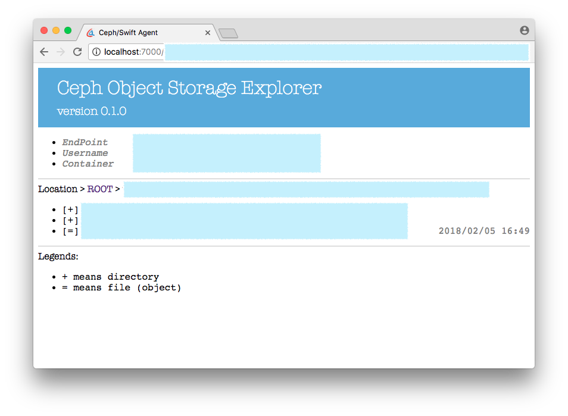

#	ceph-agent
__Simple UI for CEPH storage__

[](https://www.npmjs.com/package/ceph-agent)
[](https://www.npmjs.com/package/ceph-agent)
[](https://www.npmjs.com/package/ceph-agent)

> Languages / [简体中文](./README.zh_CN.md)

##  Description

Start a web server as an agent of remote CEPH storage.


##	ToC

*	[Get Started](#get-started)
* 	[Manual](#manual)
*	[API](#api)
*   [Recommendations](#recommendations)
*	[CHANGE LOG](./CHANGELOG.md)
*	[Homepage](https://github.com/YounGoat/nodejs.ceph-agent)

##	Get Started

Firstly, create a JSON file and put into your CEPH storage connection configurations. Only SWIFT style connection config is acceptable now.

```javascript
// swift.json
{
    "endPoint"   : "http://storage.example.com/",
    "subuser"    : "userName:subUserName",
    "key"        : "380289ba59473a368c593c1f1de6efb0380289ba5",
    "container"  : "containerName"
}
```

ATTENTION: All above options but *container* are necessary.

Then, run `ceph-agent` passing path of the JSON file.

```bash
# Install globally.
npm install -g ceph-agent

# Start agent (an HTTP proxy to CEPH storage service).
ceph-agent swift.json
```

By default, an HTTP service listening on port 7000 will be started. You may access the CEPH storage via http://localhost:7000/.



##	Manual

```bash
# Display help info.
ceph-agent -h | --help

# Start the agent (proxy server) and listen the specified port.
ceph-agent -p | --port <port>

# Specify the connection config file.
# By default, ceph-agent will try the "ceph.json" or "swift.json" in current
# working directory.
ceph-agent -C | --connection <path/to/connection-config.json>
```

##  API

```javascript
const CephAgent = require('ceph-agent');

const conn = {
    "endPoint"   : "http://storage.example.com/",
    "subuser"    : "userName:subUserName",
    "key"        : "380289ba59473a368c593c1f1de6efb0380289ba5",
    "container"  : "containerName", /* OPTIONAL */
};

const agent = new CephAgent(conn, { basepath: '/myceph/' });

// -----------------------------------------------------------------------------
// -- CASE 1: Start HTTP server directly.
agent.start();

// -----------------------------------------------------------------------------
// -- CASE 2: Return a listener.
conset handler = agent.getHandler();

// In express.
app.use('/myceph/*', handler);
```

##  Recommendations

*   [ceph](https://www.npmjs.com/package/ceph)
*   [ceph-agent](https://www.npmjs.com/package/ceph-agent)
*   [ceph-cli](https://www.npmjs.com/package/ceph-cli)
*   [ceph-sync](https://www.npmjs.com/package/ceph-sync)
*   [osapi](https://www.npmjs.com/package/osapi)
